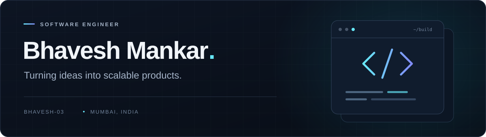

<!-- Custom banner: assets/profile-banner.svg -->

  

  <a href="https://bhaveshmankar.vercel.app/"><b>Portfolio ↗</b></a>
  &nbsp;&nbsp;·&nbsp;&nbsp;
  <a href="https://www.linkedin.com/in/bhavesh-mankar-7420ba22a/"><b>LinkedIn ↗</b></a>
  &nbsp;&nbsp;·&nbsp;&nbsp;
  <a href="mailto:bmmankar25@gmail.com"><b>Email ↗</b></a>

 

### A little about me

I'm **Bhavesh**, a **Software Engineer at JPMorgan Chase** in Mumbai. I turn ideas into scalable products, working across interfaces, APIs, and databases.

I care about clean interfaces and the engineering that makes them work.

 

### My toolbox

<table>
  <tr>
    <td><b>Languages</b></td>
    <td>    </td>
  </tr>
  <tr>
    <td><b>Frontend</b></td>
    <td>   </td>
  </tr>
  <tr>
    <td><b>Backend &amp; data</b></td>
    <td>     </td>
  </tr>
  <tr>
    <td><b>Deployment</b></td>
    <td> </td>
  </tr>
</table>

 

### Beyond the commits

  

---

  Have an idea worth building? <a href="mailto:bmmankar25@gmail.com">Let's connect.</a>

